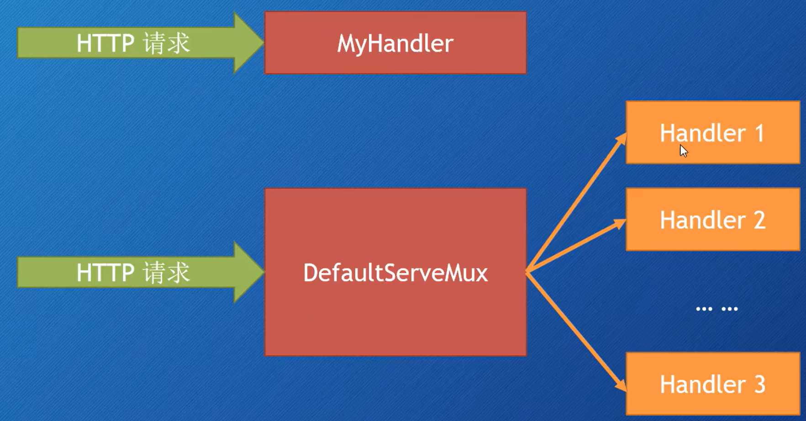
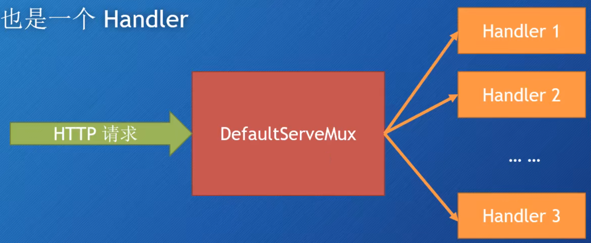
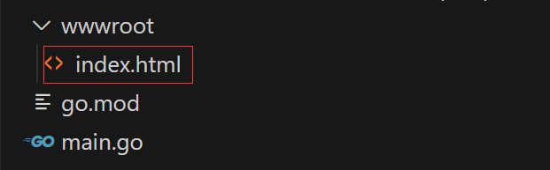

## 使用 Go 创建 Web 应用

- 处理请求
- 模板
- 中间件
- 存储数据
- HTTPS，HTTP2
- 测试
- 部署

```go
package main

import "net/http"

func main() {
	http.HandleFunc("/", func(w http.ResponseWriter, r *http.Request) {
		w.Write([]byte("Hell world"))
	})

	http.ListenAndServe("localhost:8080", nil) // 传入 nil，即 DefaultServeMux
}
```

### 处理（Handle）请求

- 如何处理（Handle）Web 请求
  - http.Handle 函数
  - http.HandleFunc 函数


#### 创建 Web Server

http.ListenAndServe(addr string, handler Handler) error

- addr：监听的地址，如果为空字符串，则使用 ":http"，即监听 80 端口
- handler：处理请求的 Handler，如果为空，则使用 DefaultServeMux

DefaultServeMux 是一个 multiplexer，即多路复用器，用于将请求分发到不同的处理器（可以看作是路由器）

```go
http.ListenAndServe("localhost:8080", nil)
```

http.Server 是一个 struct

- Addr 字段表示网络地址
  - 如果为 ""，则使用 ":http"，即监听所有网络接口的 80 端口
- Handler 字段
  - 如果为 nil，则使用 DefaultServeMux
- ListenAndServe 方法

```go
// serve := &http.Server{
serve := http.Server{
	Addr:    "localhost:8080",
	Handler: nil,
}

serve.ListenAndServe()
```

上面两种创建 Web Server 的方式，都只能使用 http。如果要用 https，则需要使用同理的 http.ListenAndServeTLS() 和 server.ListenAndServeTLS() 方法

#### Handler

Handler 是一个接口

```go
type Handler interface {
	ServeHTTP(ResponseWriter, *Request)
}
```

自己实现 Handler 接口

```go
type myHandler struct{}

func (m *myHandler) ServeHTTP(w http.ResponseWriter, r *http.Request) {
	w.Write([]byte("Hello world"))
}

func main() {
	mh := myHandler{}
	server := http.Server{
		Addr:    "localhost:8080",
		Handler: &mh,
	}
	server.ListenAndServe()
}
```



#### DefaultServeMux

DefaultServeMux 是一个 multiplexer，即多路复用器，用于将请求分发到不同的处理器（可以看作是路由器）



#### 多个 Handler - http.Handle

```go
func Handle(pattern string, handler Handler)
```

不指定 Server struct 里面的 Handler 字段值（指定为 nil）

可以使用 http.Handle 将某个 Handler 附加到 DefaultServeMux 上

- http 包有一个 Handle 函数
- ServerMux struct 也有一个 Handle 方法

如果调用 http.Handle，实际上调用的是 DefaultServeMux 的 Handle 方法

- DefaultServeMux 就是 ServerMux 的指针变量

```go
type helloHandler struct{}

func (h *helloHandler) ServeHTTP(w http.ResponseWriter, r *http.Request) {
	w.Write([]byte("Hello world"))
}

type aboutHandler struct{}

func (a *aboutHandler) ServeHTTP(w http.ResponseWriter, r *http.Request) {
	w.Write([]byte("About!"))
}

func main() {
	hello := helloHandler{}
	about := aboutHandler{}
	server := http.Server{
		Addr:    "localhost:8080",
		Handler: nil, // DefaultServeMux
	}
	http.Handle("/hello", &hello)
	http.Handle("/about", &about)
	server.ListenAndServe()
}
```

#### Handler 函数 - http.HandleFunc

Handler 函数就是那些行为与 handler 类似的函数：

- Handler 函数的签名与 ServeHTTP 方法的签名一样，接收
  - http.ResponseWriter
  - 指向 http.Request 的指针

http.HandleFunc 原理

- Go 有一个函数类型 HandlerFunc。可以将某个具有适当签名的函数 f，适配成为一个 Handler，而这个 Handler 就是调用 f 本身

```go
type helloHandler struct{}

func (h *helloHandler) ServeHTTP(w http.ResponseWriter, r *http.Request) {
	w.Write([]byte("Hello world"))
}

type aboutHandler struct{}

func (a *aboutHandler) ServeHTTP(w http.ResponseWriter, r *http.Request) {
	w.Write([]byte("About!"))
}

func welcome(w http.ResponseWriter, r *http.Request) {
	w.Write([]byte("Welcome!"))
}

func main() {
	hello := helloHandler{}
	about := aboutHandler{}
	server := http.Server{
		Addr:    "localhost:8081",
		Handler: nil, // DefaultServeMux
	}

	http.Handle("/hello", &hello)
	http.Handle("/about", &about)

	http.HandleFunc("/home", func(w http.ResponseWriter, r *http.Request) {
		w.Write([]byte("Home!"))
	})
	// http.HandleFunc("/welcome", welcome)

	http.Handle("/welcome", http.HandlerFunc(welcome))

	server.ListenAndServe()
}
```

http.HandleFunc

- http.HandleFunc(pattern string, handler func(ResponseWriter, \*Request))
- type HandlerFunc func(ResponseWriter, \*Request)

#### 内置的 handlers

- NotFoundHandler
- RedirectHandler
- StripPrefix
- TimeoutHandler
- FileServer

http.NotFoundHandler

- func NotFoundHandler() Handler
- 返回一个 handler，它给每个请求的响应都是 “404 page not found”

http.RedirectHandler

- func RedirectHandler(url string, code int) Handler
- 返回一个 handler，它把每个请求使用给定的状态码跳转到指定的 URL
  - url，要跳转到的 URL
  - code，跳转的状态码（3xx），常见的：StatusMovedPermanently，StatusFound，StatusSeeOther，StatusTemporaryRedirect，StatusPermanentRedirect

http.StripPrefix

- func StripPrefix(prefix string, h Handler) Handler
- 返回一个 handler，它从请求的 URL 中去掉指定的前缀，然后再调用另一个 handler
  - 如果请求的 URL 与提供的前缀不符，那么 404
- 略像中间件
  - prefix，URL 将要被移除的字符串前缀
  - h，是一个 handler，在移除字符串前缀之后，这个 handler 将会收到请求
- 修饰了另一个 handler

http.TimeoutHandler

- func TimeoutHandler(h Handler, dt time.Duration, msg string) Handler
- 返回一个 handler，它在指定的时间内处理请求，如果超时，就返回一个错误信息
- 也相当于是一个修饰器
  - h，将要被修饰的 handler
  - dt，第一个 handler 允许的处理时间
  - msg，如果超时，那么就把 msg 返回给请求，表示响应时间过长

http.FileServer

- func FileServer(root FileSystem) Handler
- 返回一个 handler，它会在 root 中寻找文件，并将其提供给请求

```go
type FileSystem interface {
	Open(name string) (File, error)
}
```

- 使用时需要用到操作系统的文件系统，所以还需要委托给
  - type Dir string
  - func (d Dir) Open(name string) (File, error)

例子



通过 localhost:8081/ 访问 index.html

```go
/* 方法1 */
// http.HandleFunc("/", func(w http.ResponseWriter, r *http.Request) {
// 	http.ServeFile(w, r, "wwwroot" + r.URL.Path)
// })
// http.ListenAndServe(":8081", nil)

/* 方法2 */
http.ListenAndServe(":8081", http.FileServer(http.Dir("wwwroot")))
```

### 请求

- HTTP 请求
- Request
- URL
- Header
- Body

#### HTTP 消息

- HTTP Request 和 HTTP Response（请求和响应）
- 它们具有相同的结构
  - 请求（响应）行
  - 0 个或多个 Header
  - 空行
  - 可选的消息体（Body）
- net/http 包提供了用于表示 HTTP 消息的结构

#### 请求 Request

- Request 是个 struct，代表了客户端发送的 HTTP 请求消息
- 重要的字段
  - URL
  - Header
  - Body
  - Form、PostForm、MultipartForm
- 也可以通过 Request 的方法访问请求中的 Cookie、URL、User Agent 等信息
- Request 既可以代表发送到服务器的请求，又可代表客户端发出的请求

请求的 URL

- Request 的 URL 字段就代表了请求行（请求信息第一行）里面的部分内容
- URL 字段是指向 url.URL 类型的一个指针，url.URL 是一个 struct:

URL 的通用格式：`scheme://[userinfo@]host/path[?query][#fragment]`
不以斜杠开头的 URL 被解释为：`scheme:opaque[?query][#fragment]`

```go
type URL struct {
	Scheme		string
	Opaque		string		// 编码后的不透明数据
	User		*Userinfo	// 用户名和密码信息
	Host		string		// host 或 host:port
	Path		string
	RawPath		string		// 编码后的 path，保留了转义符
	ForceQuery	bool		// 是否在 URL 中添加 ? 强制添加查询参数
	RawQuery	string		// 编码后的查询字符串，没有 '?'
	Fragment	string		// 引用的片段（文档位置），没有 '#'
}
```

URL Query

- RawQuery 会提供实际查询的字符串
- 例如：`http://localhost:8080/?name=abc&age=18`
  - RawQuery 为：`name=abc&age=18`

URL Fragment

- 如果从浏览器发出的请求，就无法提取出 Fragment 字段的值
  - 浏览器在发送请求时会把 fragment 部分去掉
- 但不是所有的请求都是从浏览器发出的（例如从 http 客户端包）

Request Header

- 请求和相应（Request、Response）的 headers 是通过 Header 类型来描述的，它是一个 map，用来表述 HTTP Header 里的 Key-Value 对
- Header map 的 key 是 string 类型，value 是一个字符串切片 []string
- 设置 key 的时候会创建一个空的 []string 作为 value，value 里面第一个元素就是新 header 的值
- 为指定的 key 添加一个新的 header 值，执行 append 操作即可
- r.Header，返回 map
- r.Header["Accept-Encoding"]，返回 [gzip, deflate]，[]string 类型
- r.Header.Get("Accept-Encoding")，返回 gzip, deflate，string 类型

```go
server := http.Server{
	Addr: "localhost:8081",
}

http.HandleFunc("/header", func(w http.ResponseWriter, r *http.Request) {
	fmt.Fprintln(w, r.Header)
	fmt.Fprintln(w, r.Header["Accept-Encoding"])
	fmt.Fprintln(w, r.Header.Get("Accept-Encoding"))
})

server.ListenAndServe()
```

Request Body

- 请求和相应的 bodies 都是使用 Body 字段来表示的
- Body 是一个 io.ReadCloser 接口

```go
type ReadCloser interface {
	Reader
	Closer
}
```

- Reader 接口定义了一个 Open() 方法
  - 参数：[]byte
  - 返回：byte 的数量、可选的错误
- Closer 接口定义了一个 Close() 方法
  - 返回：可选的错误
- 想要读取请求 Body 的内容，可以调用 Body 的 Read 方法

```go
server := http.Server{
	Addr: "localhost:8081",
}

http.HandleFunc("/post", func(w http.ResponseWriter, r *http.Request) {
	length := r.ContentLength
	body := make([]byte, length)
	r.Body.Read(body)
	fmt.Fprintln(w, body)
	fmt.Fprintln(w, string(body))
})

server.ListenAndServe()
```

#### 查询参数（Query Parameters）

URL Query

- http://localhost:8080/?name=abc&age=18
  - r.URL.RawQuery 为：`name=abc&age=18`（实际查询的原始字符串）
  - r.URL.Query() 方法返回 map[string][]string
    - map 的 key 是 string 类型
    - map 的 value 是 []string 类型

```go
// http://localhost:8081/query?id=123&name=张三&id=466&name=李四
	server := http.Server{
		Addr: "localhost:8081",
	}

	http.HandleFunc("/query", func(w http.ResponseWriter, r *http.Request) {
		url := r.URL
		query := url.Query()

		id := query["id"]
		log.Println(id)

		name := query.Get("name")
		log.Println(name)
	})

	server.ListenAndServe()
```
