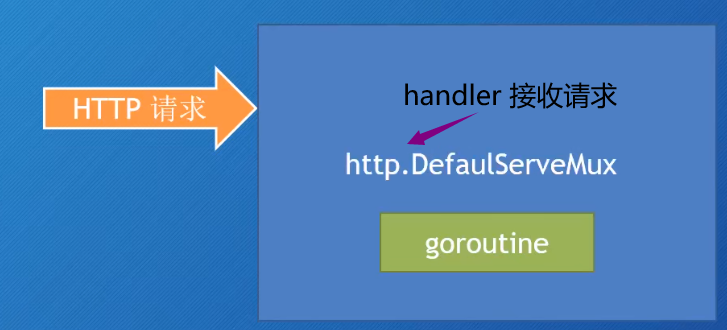

## 使用 Go 创建 Web 应用

- 处理请求
- 模板
- 中间件
- 存储数据
- HTTPS，HTTP2
- 测试
- 部署

```go
package main

import "net/http"

func main() {
	http.HandleFunc("/", func(w http.ResponseWriter, r *http.Request) {
		w.Write([]byte("Hell world"))
	})

	http.ListenAndServe("localhost:8080", nil) // 传入 nil，即 DefaultServeMux
}
```

### 处理（Handle）请求

- 如何处理（Handle）Web 请求
  - http.Handle 函数
  - http.HandleFunc 函数



#### 创建 Web Server

http.ListenAndServe(addr string, handler Handler) error

- addr：监听的地址，如果为空字符串，则使用 ":http"，即监听 80 端口
- handler：处理请求的 Handler，如果为空，则使用 DefaultServeMux

DefaultServeMux 是一个 multiplexer，即多路复用器，用于将请求分发到不同的处理器（可以看作是路由器）

```go
http.ListenAndServe("localhost:8080", nil)
```

http.Server 是一个 struct

- Addr 字段表示网络地址
  - 如果为 ""，则使用 ":http"，即监听所有网络接口的 80 端口
- Handler 字段
  - 如果为 nil，则使用 DefaultServeMux
- ListenAndServe 方法

```go
// serve := &http.Server{
serve := http.Server{
	Addr:    "localhost:8080",
	Handler: nil,
}

serve.ListenAndServe()
```

上面两种创建 Web Server 的方式，都只能使用 http。如果要用 https，则需要使用同理的 http.ListenAndServeTLS() 和 server.ListenAndServeTLS() 方法

#### Handler

Handler 是一个接口

```go
type Handler interface {
	ServeHTTP(ResponseWriter, *Request)
}
```

自己实现 Handler 接口

```go
type myHandler struct{}

func (m *myHandler) ServeHTTP(w http.ResponseWriter, r *http.Request) {
	w.Write([]byte("Hello world"))
}

func main() {
	mh := myHandler{}
	server := http.Server{
		Addr:    "localhost:8080",
		Handler: &mh,
	}
	server.ListenAndServe()
}
```


#### DefaultServeMux

DefaultServeMux 是一个 multiplexer，即多路复用器，用于将请求分发到不同的处理器（可以看作是路由器）


#### 多个 Handler - http.Handle

```go
func Handle(pattern string, handler Handler)
```

不指定 Server struct 里面的 Handler 字段值（指定为 nil）

可以使用 http.Handle 将某个 Handler 附加到 DefaultServeMux 上

- http 包有一个 Handle 函数
- ServerMux struct 也有一个 Handle 方法

如果调用 http.Handle，实际上调用的是 DefaultServeMux 的 Handle 方法

- DefaultServeMux 就是 ServerMux 的指针变量

```go
type helloHandler struct{}

func (h *helloHandler) ServeHTTP(w http.ResponseWriter, r *http.Request) {
	w.Write([]byte("Hello world"))
}

type aboutHandler struct{}

func (a *aboutHandler) ServeHTTP(w http.ResponseWriter, r *http.Request) {
	w.Write([]byte("About!"))
}

func main() {
	hello := helloHandler{}
	about := aboutHandler{}
	server := http.Server{
		Addr:    "localhost:8080",
		Handler: nil, // DefaultServeMux
	}
	http.Handle("/hello", &hello)
	http.Handle("/about", &about)
	server.ListenAndServe()
}
```

#### Handler 函数 - http.HandleFunc

Handler 函数就是那些行为与 handler 类似的函数：

- Handler 函数的签名与 ServeHTTP 方法的签名一样，接收
  - http.ResponseWriter
  - 指向 http.Request 的指针

http.HandleFunc 原理

- Go 有一个函数类型 HandlerFunc。可以将某个具有适当签名的函数 f，适配成为一个 Handler，而这个 Handler 就是调用 f 本身

```go
type helloHandler struct{}

func (h *helloHandler) ServeHTTP(w http.ResponseWriter, r *http.Request) {
	w.Write([]byte("Hello world"))
}

type aboutHandler struct{}

func (a *aboutHandler) ServeHTTP(w http.ResponseWriter, r *http.Request) {
	w.Write([]byte("About!"))
}

func welcome(w http.ResponseWriter, r *http.Request) {
	w.Write([]byte("Welcome!"))
}

func main() {
	hello := helloHandler{}
	about := aboutHandler{}
	server := http.Server{
		Addr:    "localhost:8081",
		Handler: nil, // DefaultServeMux
	}

	http.Handle("/hello", &hello)
	http.Handle("/about", &about)

	http.HandleFunc("/home", func(w http.ResponseWriter, r *http.Request) {
		w.Write([]byte("Home!"))
	})
	// http.HandleFunc("/welcome", welcome)

	http.Handle("/welcome", http.HandlerFunc(welcome))

	server.ListenAndServe()
}
```

http.HandleFunc

- http.HandleFunc(pattern string, handler func(ResponseWriter, \*Request))
- type HandlerFunc func(ResponseWriter, \*Request)
