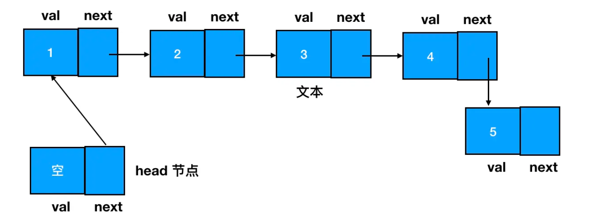

## 基础

### JS 语法

#### 数组

创建一个长度确定、同时每一个元素的值也都确定的数组

```js
const arr = new Array(10).fill(0);
```

增加/删除元素的三种方法

- push / pop
- unshift / shift
- splice

:::warning 注意

1. 从性能上看，for 循环遍历起来是最快的
2. 当你给 fill 传递一个入参时，如果这个入参的类型是引用类型，那么 fill 在填充坑位时填充的其实就是入参的引用
3. 在算法题目中，见到“矩阵”时，要立刻反射出它说的是二维数组

:::

### 常见数据结构

- 数组
  - 访问效率较高，而插入/删除效率较低
- 栈
  - 只用 pop 和 push 完成增删的“数组”
- 队列
  - 只用 push 和 shift 完成增删的“数组”
- 链表
  - 
  - 插入/删除效率较高，而访问效率较低
- 树（二叉树）

### 二叉树的递归遍历

```js
const preorder = (root) => {
  if (!root) return;
  console.log("当前遍历的节点是：", root.val);
  preorder(root.left);
  preorder(root.right);
};

const inorder = (root) => {
  if (!root) return;
  inorder(root.left);
  console.log("当前遍历的节点是：", root.val);
  inorder(root.right);
};

const postorder = (root) => {
  if (!root) return;
  postorder(root.left);
  postorder(root.right);
  console.log("当前遍历的节点是：", root.val);
};
```

### 评价算法能力

时间复杂度（常见的如下）：反映算法对应的执行总次数的一个变化趋势

- 常数时间 `O(1)`
- 对数时间 `O(logn)`
- 线性时间 `O(n)`
- 线性对数时间 `O(nlogn)`
- 二次时间 `O(n^2)`
- 三次时间 `O(n^3)`
- 指数时间 `O(2^n)`

空间复杂度（常见的如下）：对一个算法在运行过程中临时占用存储空间大小的量度，反映内存增长的趋势

- O(1)
- O(n)
- O(n^2)
