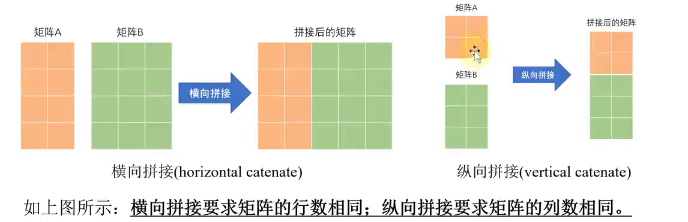
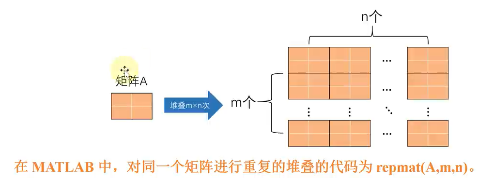
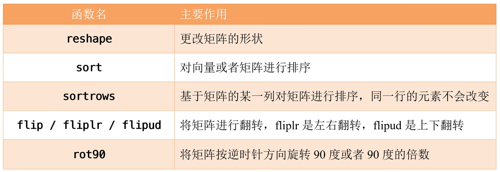
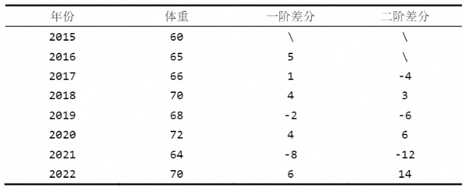
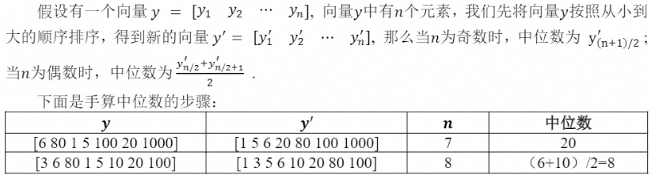

## 注释

快捷键 `ctrl + r`

取消注释 `ctrl + t`

两个 %% 即可实现分节，按住 ctrl 和上下键可以实现跳转

`ctrl + enter` 只运行当前小节的代码

## 变量

命名必须以字母开头

`iskeyword` 获取关键字的完整列表

MATLAB 定义了一些比较特殊的变量：

- `ans` 系统默认的保存运算结果的变量名
- `pi` 圆周率 Π
- `inf / -inf` 无穷大和负无穷大，注意 1 / 0 = inf
- `NaN` 不定值或缺失值，例如 0 / 0 或者 0 \* inf 会返回 NaN
- `i 和 j` 复数中的虚数单位，例如 3 + 4i 和 3 + 4j 表示同一个复数
- `eps` 浮点相对精度。可以简单地将 eps 看作一个非常小的数，这个数大约等于 2.22e-16， 0 / (0 + eps) = 0

设置 MATLAB 的数值显示方式：

- format long g 也可以写成 format longG

- `doc format` 查看 format 的帮助文档

::: tip 小技巧
`clc` 可以清空命令行窗口；`clear` 清空工作区

一些计算结果不需要在命令行显示，可以在代码的最后加上英文分号

两行代码放在同一行，也用分号分隔开
:::

## 常见的数学运算函数

- `+ - * / ^`

- `abs(数值)` 求绝对值、复数的模长
- `floor(数值)` 朝负无穷大截取整数
- `fix(数值)` 朝 0 截取整数
- `ceil(数值)` 朝正无穷大截取整数
- `round(X, [N])` 将 X 在第 N 位数四舍五入
  - N > 0，四舍五入到小数点右侧的第 N 位数
  - N = 0，四舍五入到最接近的整数
  - N < 0，四舍五入到小数点左侧的第 N 位数
- `mod(a, m)`，a 除以 m 后的余数
- `sqrt(a)`，计算 a 的平方根，可以为负数
- `exp(a)`，自然常数 e 的 a 次方
- `log(a)`，自然常数 e 为底的对数
- `log2(a)`、`log10(a)`，分别计算以 2、10 为底的对数

## 矩阵

向量 --> 一维数组，矩阵 --> 二维数组

### 向量

#### 创建向量

1. 直接输入法

```matlab
% 行向量
a = [1, 2, 3]
b = [1 2 3]

% 列向量
c = [1; 2; 3]
d = [1
    2
    3]
```

2. 冒号法

`A:step:B`，A 是起始值，step 是每次递增或递减的步长，B 是终止值（不一定刚好停在这里，<= B）；若 step = 1，则可简写为 A:B

3. 利用 MATLAB 函数创建

```matlab
% 等差数列
% linspace(a, b, [n])，创建一个行向量，第一个元素为 a，最后一个元素为 b，形成总数为 n（默认为 100） 个元素的线性间隔的向量

% 等比数列
% logspace(a, b, [n])，创建一个行向量，第一个元素为 10^a，最后一个元素为 10^b，形成总数为 n（默认为 50）个元素的等比向量
a = logspace(log10(2), log10(1024), 10)
```

#### 向量元素的引用

length 或者 numel 函数都可以计算向量中包含的元素个数

```matlab
a = [1, 3, 8, 9, 7];
b1 = length(a)
b2 = numel(a)
```

::: warning 注意
MATLAB 中，数组的索引是从 1 开始的
:::

1. 单个元素的引用

```matlab
a = [1, 3, 8, 9, 7];

% a(ind)，超出范围会报错
a(5)
```

2. 多个元素引用

```matlab
% ind 可以是一个索引数组
a = [1, 3, 8, 9, 7];
ind = [1, 3];
b1 = a(ind)

% end 关键字表示数组最后一个元素的索引，end 还可以用于计算
b2 = a(3: end)
b3 = a(3: end - 1)
```

#### 向量元素的修改和删除

```matlab
% 修改
a(1) = 4;
a([1, 3]) = [50, 60];
a(2:4) = 100; % 指定位置的元素都变为 100

% 删除
a(1) = []; % 删除 a 的第一个元素
a(end - 1:end) = []; % 删除 a 中最后两个元素
```

### 矩阵

#### 创建矩阵

**1. 直接输入法**

```matlab
% 同行元素用空格或者逗号分开，行与行之间用分号或者回车键分隔
a = [1 2 3; 4 5 6]
```

**2. 函数创建法**

- `zeros(m, [n])、ones(m, [n]) 和 eye(m, [n])`，分别用来创建 0 矩阵，1 矩阵和单位矩阵
- 关键词：随机数， `rand、randi 和 randn`，分别用来创建均匀分布的随机数、均匀分布的随机整数和标准正态分布的随机数
  - rand(m, [n]) 函数用来创建 0 和 1 内均匀分布的随机数
  - randi([imin, imax], m, [n])，可以创建一个 m 行 n 列的随机数矩阵，该随机数矩阵中的每个元素都是从 [imin, imax] 内随机抽取的整数
    - 如果 imin = 1，即可简写为 rand(imax, m, n)
  - randn(m, [n])
- `diag 和 blkdiag`
  - diag 函数可用来创建对角矩阵或者获取矩阵的对角元素
    - 如果第一个参数是向量，则表示创建对角矩阵
      - diag(v, k)，将向量 v 的元素放置在第 k 条对角线上，其他位置元素为 0。k = 0 表示主对角线，k > 0 位于主对角线上方， k < 0 位于主对角线下方。如果 k = 0，可以直接写成 diag(v)
    - 如果第一个参数是矩阵，则表示获取矩阵的对焦元素
      - diag(A, k)，返回 A 的第 k 条对角线上元素构成的**列向量**。k 的规则同上
  - blkdiag(A1, A2, ...) 函数可用来创建分块对角矩阵

**3. 导入本地文件中的数据**

MATLAB 可读取本地的文件，支持的常见格式如下：

- .txt、.dat 或 .csv（适用于带分隔符的文本文件）
- .xls、.xlsb、.xlsm、.xltm、.xltx 或 .ods（适用于电子表格文件）

重点关注 MATLAB “主页——导入数据”这个功能

#### 矩阵元素的引用

`a(row_ind, col_ind)`，过于 row_ind, col_ind

- 若都是常数，则表示提取矩阵中的单个元素
- 若是包含多个元素的向量，则表示同时提取多个位置上的元素

与向量类似，end 也可以用来替代最后一个索引，常和冒号法一起使用

```matlab
a = randi([2, 10], 4, 5)
a(1, 2)
a(2, end)
a(2, [1, 3])
a(3, 1:5)
a([1, 3], [1, 3, 5])
% 奇数行且奇数列对应位置的元素
a(1:2:end, 1:2:end)
% a(:, n) 表示矩阵的第 n 列 的所有元素
a(:, 1)
a(:, [2, 5])
% a(m, :) 表示矩阵第 m 行的所有元素
a(1, :)
a(end, :)
```

`size` 函数：

- size(A) 返回一个行向量，其元素是 A 的各维度长度。若 A 是一个 3 x 4 的矩阵，则 size(A) 返回向量 [3 4]；如果让 [r, c] = size(A)，那么 r = 3，c = 4
- size(A, dim) 返回在维度 dim 上的长度。 如：dim = 1, 表示行；dim = 2，表示列

```matlab
  A = ones(3, 4)
  size(A)
  [r, c] = size(A)
  r_mun = size(A, 1)
  r_col = size(A, 2)
```

::: warning 注意
`length(A)` 会返回行和列中的较大值；`numel(A)` 会返回矩阵中元素的总数
:::

前面都是对矩阵的双下标进行索引，事实上，在 MATLAB 中也能使用单个下标对矩阵进行索引，称为线性索引（矩阵按照各列顺次连接）

```matlab
% A(:) 可以将矩阵 A 中的所有元素按照线性索引的顺序重构成一个列向量
A = randi(100, 2, 3)
A(:)
% 同理对向量也有同样的效果（行 -> 列）
```

`sub2ind 和 ind2sub` 函数可用于在矩阵的原始索引和线性索引之间进行转换：

- ind = sub2ind(sz, row, col) 针对大小为 sz 的矩阵返回由 row 和 col 指定的行列下标的对应线性索引 ind。其中 sz 是包含两个向量的元素，sz(1) 是行数，sz(2) 是列数
- [row, col] = ind2sub(sz, ind)

#### 矩阵元素的修改和删除

**修改**

```matlab
A = [1:4; 2:5; 3:6]
A(2, 3) = 10
A(3, :) = 100
A([1, 3], [2, 3]) = [8 88; 888 8888]
```

::: warning 注意
如果在赋值时，将一个或多个元素置于矩阵现有的行和列索引的边界之外，则会将矩阵的大小进行拓展，没有赋值的位置自动用 0 填充，使其保持完整的矩形
:::

此外可以通过在现有索引之外插入一个新的矩阵来拓展原始矩阵的大小

```matlab
A = [10, 20, 30;
    60, 70, 80]
A(4:5, 5:6) = [2 3; 4 5]
```

**删除**

将等号右侧变成空向量 `[]`，则可以删除对应位置的元素。需要注意的是，**通常只能删除矩阵的整行或者整列，否则会报错**

```matlab
A = [1:4; 2:5; 3:6]
% 删除第一列
A(:, 1) = []

A = [1:4; 2:5; 3:6]
% 删除第2， 最后列
A(:, [2, end]) = []
```

注意，也可以使用线性索引来删除矩阵元素。使用线性索引删除后，MATLAB 会将矩阵中剩下的元素按照线性索引的顺序放入到一个向量中。另外，使用线性索引可以删除任意位置的元素，
不需要删除矩阵的一整行或者一整列，但得到的是一个向量

```matlab
A = [1:4; 2:5; 3:6]
A(1:4) = []
```

#### 矩阵的拼接和重复

**拼接**



横向拼接：

- [A, B, ...]
- [A B ...]
- horzcat(A, B, ...)

纵向拼接：

- [A; B; ...]，或者用换行符隔开
- vertcat(A, B, ...)

`cat(dim, A, B, ...)` 函数表示沿着维度 dim 方向将矩阵 B 拼接到矩阵 A 的末尾

- dim = 1，即纵向拼接
- dim = 2，即横向拼接

**重复**



```matlab
% 对矩阵重复
A = [1, 2; 3, 4]
B = repmat(A, 2, 3)
```

除了对整个矩阵进行重复的堆叠外，MATLAB 还可以对向量或矩阵中的元素进行重复，使用 `repelem` 函数：

- `repelem(v, n)`，重复向量 v 中的元素
  - 当 n 为一个正整数时，表示把 v 中的每一个元素都重复 n 次；n 也可以为一个向量，其长度必须和 v 相同，它可以将 v(i) 重复 n(i) 次
  ```matlab
  v = [5 3 8];
  ans1 = repelem(v, 2) % [5 5 3 3 8 8]
  ans2 = repelem(v, [2, 1, 4]) % [5 5 3 8 8 8 8]
  ```
- `repelem(A, m, n)`，重复矩阵 A 中的元素
  - m 和 n 分别表示沿着行方向（从上至下）以及沿着列方向（从左至右）将矩阵元素重复的次数，同理可以是整数或者向量
  ```matlab
  A = [2, 3, 5;
        8, 4, 7]
  % 针对 A 中的每个元素，沿着行方向重复 3 次，沿着列方向重复 2 次
  B = repelem(A, 3, 2)
  % 针对 A 中的每个元素，第一行重复两次，第二行重复 3 次；第一列重复 1 次，第二列重复 2 次，第三列重复 3 次
  C = repelem(A, [2, 3], [1, 2, 3])
  ```

#### 矩阵的重构和重新排列



##### reshape

`reshape(A, m, n)` 或者 `reshape(A, [m, n])` 可将矩阵 A 的改为 m 行 n 列（按照线性索引的顺序），前提是转换前后的两个矩阵的元素总数相同

```matlab
A = randi(10, 2, 6)
B = reshape(A, 3, 4)
% A(:) 与 B(:) 相同
% 用 [] 代替转换后的列数或者行数，MATLAB 会对它进行计算
B1 = reshape(A, 3, [])
B2 = reshape(A, [], 4)
```

##### sort

**对向量排序**

假设 v 是一个向量，有下面两种基础用法：

- `sort(v)`，升序排列
- `sort(v, 'descend')`，降序排序

```matlab
v = [10 24 16 8 50 40]
r1 = sort(v)
r2 = sort(v, 'descend')
% 事实上，sort 返回了两个参数
[sort_v, ind] = sort(v) % sort_v 与 v(ind) 相同
```

**对矩阵排序**

`sort(A, dim)`：

- dim = 1，沿着行方向（从上至下）对矩阵的每一列升序排列
- dim = 2，沿着列方向（从左至右）对矩阵的每一行升序排列

```matlab
A = randi(10, 4, 6)
% 升序
B1 = sort(A)
B2 = sort(A, 1)
B3 = sort(A, 2)
% 降序
C1 = sort(A, 1, 'descend')
C2 = sort(A, 2, 'descend')
% 同理，也有两个返回值
[sort_A, ind] = sort(A)
```

##### sortrows

默认升序

`sortrows(矩阵, [参与排序的列-整数或者向量], [每一列排序的方向-两列eg： {'ascend', 'descend'}])` 函数基于矩阵的某一列对矩阵进行排序，排序后得到的新矩阵同一行不会改变

`sortrows(score) 等价于 sortrows(score, 1:size(score, 2))`

`[sort_score, ind] = sortrows(score, 1)`，其中 ind 表示当前行在原矩阵中的行数，`sort_score` 与 `score(ind, :)` 结果相同

##### flip / fliplr / flipud

**flip**

- `flip(v)`，翻转向量中各个元素的顺序，向量的方向不变
- `flip(A, [dim = 1])`，对矩阵进行上下（dim = 1）、左右翻转（dim = 2）

```matlab
v = [5 2 7 8 9]
r1 =  flip(v) % [9 8 7 2 5]
r = flip(v, 1) % 不变，上下翻转

A = [5 8 7;
    4 2 6;
    3 5 8;
    6 4 1]
r2 = flip(A) % 对每一列进行翻转，前后对应行不会变
r3 = flip(A, 2) % 对每一行进行翻转，前后对应列不会变
```

##### rot90

rotate 旋转

`rot90(A, k)`，将矩阵 A 沿着逆时针方向旋转 k \* 90°，其中 k 是一个整数，默认为 1

```matlab
A = [5 8 7;
    4 2 6;
    3 5 8;
    6 4 1]
B1 = rot90(A)
B2 = rot90(A, 2)
% 下面两个结果等价
B3 = rot90(A, 3)
B4 = rot90(A, -1)
```

### 矩阵运算

#### 调用函数

常见的数学运算函数，如 abs、sin、exp、round 等，都可以直接作用于矩阵，即对矩阵每个元素分别应用这些函数，因此返回的结果也是矩阵

##### sum，求和

- 如果 A 是一个向量，则 sum(A)可以计算 A 中所有元素的和
- 如果 A 是一个矩阵，则 sum(A, dim)可以计算 A 矩阵沿维度 dim 中所有元素的和
  - dim = 1（默认值） 表示沿着行方向进行计算，即计算矩阵每一列的和，返回一个行向量
  - dim = 2 表示沿着列方向进行计算，即计算矩阵每一行的和，返回一个列向量
  - 计算一个矩阵中所有元素的总和 `sum(sum(A))` or `sum(A(:))`，从 MATLAB2018b 版本开始，可以使用 `sum(A, all)` 来计算所有元素的和
- 指定如何处理 NaN 值 `sum(A, 'omitnan') % 忽略NaN值`

##### prod，计算乘积

prod 函数的用法和 sum 函数的用法相同，它是用来计算乘积的

```matlab
v=[2,4,5,1,10]; % 向量
% 直接求向量中所有元素的乘积
prod(v)  % 400

% 计算 10 的阶乘
v = 1:10;
prod(v)
% 熟练的话可以直接写成 prod(1:10)

% 下面看矩阵的例子
A = randi(10, 3, 4)
prod(A) % 计算每列的乘积
% 也可以写成 prod(A, 1)
prod(A, 2) % 计算每行的乘积

v = [2, 4, NaN, 1, 10]; % 有 NaN 值
prod(v)
% 如果计算时忽略 NaN 值，可以在最后面加上 omitnan 参数
prod(v， 'omitnan')
```

##### cumsu，计算累积和

- 如果 A 是一个向量，则 cumsum(A) 可以计算向量 A 的累积和（累加值）
  ```matlab
  A=[1 5 3 4 -5 0 8];
  cumsum(A) % 1 6 9 13 8 8 16
  ```
- 如果 A 是一个矩阵，则 cumsum(A,dim)可以计算 A 沿维度 dim 中所有元素的累积和，具体的使用方法和 sum 函数类似

##### diff，计算差分



- 如果 A 是一个向量，diff(A, n) 命令计算向量 A 的 n 阶差分，当 n 等于 1 时，可以直接写成 diff(A)
- 如果 A 是一个矩阵，dff(A,n,dim)表示沿矩阵 A 的维度 dim 方向上计算差分，
  - 当 dim=1 时沿着行方向计算，即得到每列的 n 阶差分；类似的，dim=1 时，diff(A,n,1)也可以简写成 diff(A,n)
  - 当 dim=2 时沿着列方向计算，即得到每行的 n 阶差分

::: warning 注意
diff 函数不支持使用 'omitnan' 参数来忽略向量或者矩阵中的 NaN 值
:::

##### mean，计算平均值

使用方法和 sum 函数类似

##### media，计算中位数



使用方法和 sum 函数类似

##### mod，计算众数

使用方法和 sum 函数类似

::: warning 注意
使用 mode 函数计算众数时会自动忽略 NaN 值，不能额外添加 'omitnan' 参数
:::

mode 函数有两个返回值的例子，如果 A 是一个向量， `[M,F] = mode(A)` 得到的 M 表示向量 A 的众数，F 表示众数 M 在向量 A 中出现的次数

```matlab
A=[-1 2 0 8 -1 0 2 1 8 0 8];
[M,F] = mode(A) % M = 0, F = 3
% 上面这个例子中，有两个众数，分别是0和8，它们出现的次数都是3次，此时MATLAB会返回最小的那个数作为众数
```
