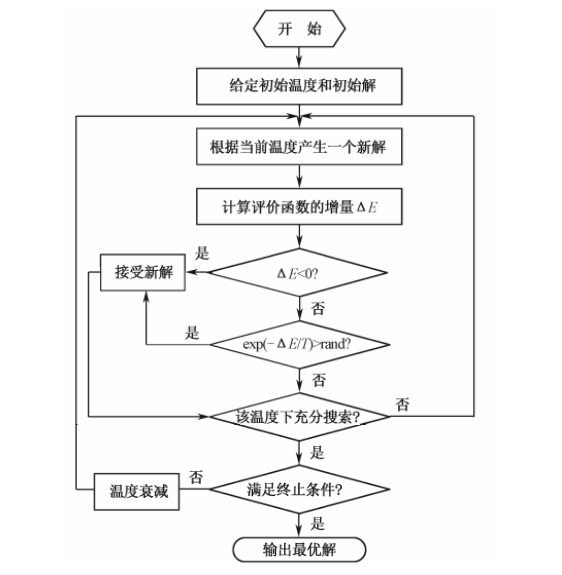

## 流程

1. 初始化:设置初始温度 T0(充分大，可以均匀抽样一组状态, 以各状态目标值的方差为初温)、初始解状态 X0(是算法迭代的起点)、每个 T 值的迭代次数 L（一般取 100~1000）;
2. 对 k = 1, ⋯, L 进行第(3)至第(6)步操作;
3. 产生新解 X′;
4. 计算增量 ΔE = E(X′)  E(X),其中 E(X)为评价函数;
5. 若 ΔE < 0,则接受 X′作为新的当前解,否则以概率 exp(ΔE/T)接受 X′ 作为新的当前解;
6. 如果满足终止条件,则输出当前解作为最优解,结束程序;
7. T 逐渐减小,且 T→0,然后转第(2)步。`最常用的温度更新函数为指数退温函数,即 T(n + 1) = K×T(n),其中 0 < K < 1 是一个非常接近于 1 的常数`

模拟退火算法流程如图所示：



## MATLAB 仿真实例

### 计算函数的最小值

计算函数 $f(x) = \sum_{i=1}^{n} x_i^2 \quad (-20 \leq x_i \leq 20)$ 的最小值，其中个体 $x$ 的维数 $n = 10$。

这是一个简单的平方和函数，只有一个极小点：$x = (0,\, 0,\, \cdots,\, 0)$，理论最小值为 $f(0,\, 0,\, \cdots,\, 0) = 0$

```matlab
%%%%%%%%%%%%%%%模拟退后算法解决函数极值%%%%%%%%%%%%%%%
%%%%%%%%%%%%%%%初始化%%%%%%%%%%%%%%%
clear all; % 清除所有变量
close all; % 清图
clc; % 清屏
D = 10; % 变量维数
Xs = 20; % 上限
Xx = -20; % 下限
trace = [];
%%%%%%%%%%%%%%%冷却表参数%%%%%%%%%%%%%%%
L = 200; % 马尔科夫链长度
K = 0.998; % 衰减参数，控制温度降低 T(n+1) = KT(n)
S = 0.01; % 步长因子
T = 100; % 初始温度
YZ = 1e-8; % 容差
P = 0; % Metropolis 过程中总接受点
%%%%%%%%%%%%%%%随机选点初值设定%%%%%%%%%%%%%%%
PreX = rand(D, 1) * (Xs -Xx) + Xx;
PreBestX = PreX;
PreX = rand(D, 1) * (Xs -Xx) + Xx;
BestX = PreX;
%%%%%%%%%%%%%%%每迭代一次退火一次（降温），知道满足迭代条件为止%%%%%%%%%%%%%%%
deta = abs(func1(BestX) - func1(PreBestX));
while (deta > YZ) && (T > 0.001)
    T = K * T;
    %%%%%%%%%%%%%%%在当前温度T下迭代次数%%%%%%%%%%%%%%%
    for i = 1:L
        %%%%%%%%%%%%%%%在此点附近随机选择下一点%%%%%%%%%%%%%%%
        NextX = PreX + S * (rand(D, 1) * (Xs -Xx) + Xx);
        %%%%%%%%%%%%%%%边界条件处理%%%%%%%%%%%%%%%
        for ii = 1:D
            if NextX(ii) > Xs || NextX(ii) < Xx
               NextX(ii) = PreX(ii) + S * (rand * (Xs - Xx) + Xx);
               NextX(ii) = min(max(NextX(ii), Xx), Xs);  % 强制裁剪到边界
            end
        end
        %%%%%%%%%%%%%%%是否为全局最优解%%%%%%%%%%%%%%%
        if (func1(BestX) > func1(NextX))
            %%%%%%%%%%%%%%%保留上一个最优解%%%%%%%%%%%%%%%
            PreBestX = BestX;
            %%%%%%%%%%%%%%%此为最新的最优解%%%%%%%%%%%%%%%
            BestX = NextX;
        end
        %%%%%%%%%%%%%%%Metropolis过程%%%%%%%%%%%%%%%
        if (func1(PreX) - func1(NextX) > 0)
            %%%%%%%%%%%%%%%接受新解%%%%%%%%%%%%%%%
            PreX = NextX;
            P = P + 1;
        else
            changer = -1 * (func1(NextX) - func1(PreX)) / T;
            p1 = exp(changer); % 接受较差的解的概率
            %%%%%%%%%%%%%%%接受较差的解%%%%%%%%%%%%%%%
            if p1 > rand
                PreX = NextX;
                P = P + 1;
            end
        end
    trace(P+1) = func1( BestX);
    end
    deta = abs( func1( BestX)-func1(PreBestX));
end
disp('最小值在点:');
BestX
disp( '最小值为:');
func1(BestX)
figure
plot(trace(2:end))
xlabel('迭代次数')
ylabel('目标函数值')
title('适应度进化曲线')
%%%%%%%%%%%%%%%%%适应度函数%%%%%%%%%%%%%%%%%
function result = func1(x)
summ = sum(x.^2);
result = summ;
end
```
