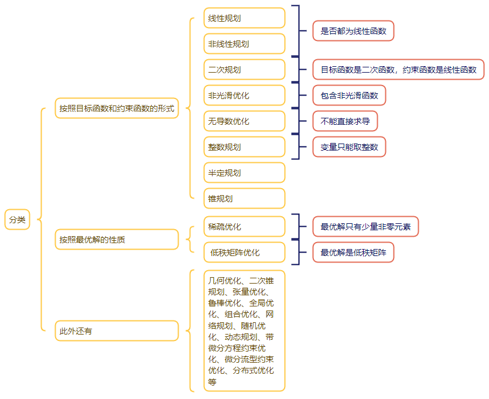
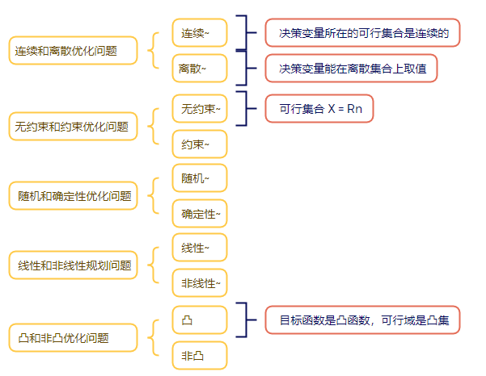
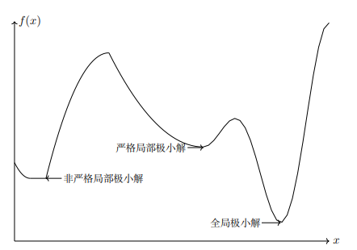

## 1.1 最优化问题概括

最优化问题一般可以描述为

$$
\begin{align}
\min_{x} \quad & f(x) \\
\text{s.t.} \quad & x \in \mathcal{X} \\
                %  & g(x) \le 0 \\
                %  & h(x) = 0
\end{align}
\tag{1.1.1}
$$



一个 matlab 例子：

```matlab
m = 128; n = 256;
A = randn(m, n); % 标准正态分布的随机数
u = sprandn(n, 1, 0.1); % 创建一个密度为 0.1 的随机 n×1 稀疏矩阵。该矩阵有大约 0.1*n*1 个正态分布的非零项
b = A * u;
```

一般来说，最优化算法研究可以分为：构造最优化模型、确定最优化问题的类型和设计算法、实现算法或调用优化算法软件包进行求解



## 1.2 基本概念

**定义 1.1（最优解）**  
对于可行点 $\bar{x}$（即 $\bar{x} \in \mathcal{X}$），定义如下概念：

1. 如果 $f(\bar{x}) \le f(x), \ \forall x \in \mathcal{X}$，那么称 $\bar{x}$ 为问题 $\textcolor{red}{(1.1.1)}$ 的**全局极小解（点）**，有时也称为（全局）最优解或最小值点；

2. 如果存在 $\bar{x}$ 的一个 $\varepsilon$ 邻域 $N_\varepsilon(\bar{x})$ 使得 $f(\bar{x}) \le f(x), \ \forall x \in N_\varepsilon(\bar{x}) \cap \mathcal{X}$，  
   那么称 $\bar{x}$ 为问题 $\textcolor{red}{(1.1.1)}$ 的**局部极小解（点）**，有时也称为局部最优解。

3. 进一步地，如果有 $f(\bar{x}) < f(x), \ \forall x \in N_\varepsilon(\bar{x}) \cap \mathcal{X}, x \neq \bar{x}$ 成立，则称 $\bar{x}$ 为问题 $\textcolor{red}{(1.1.1)}$ 的**严格局部极小解（点）**



**优化算法分类**

依点列收敛到局部（全局）极小解：

- 全局依点列收敛到局部（全局）极小解
